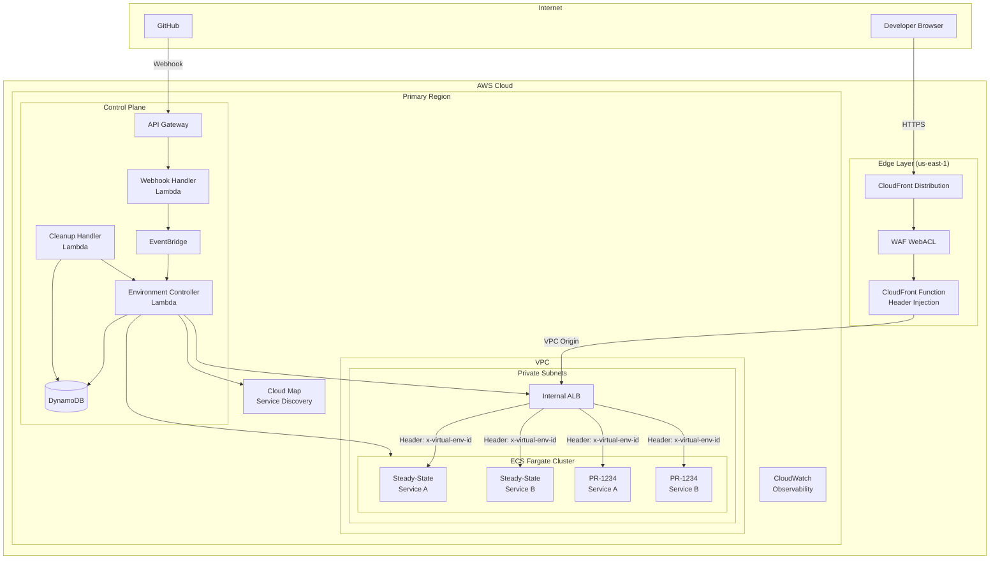
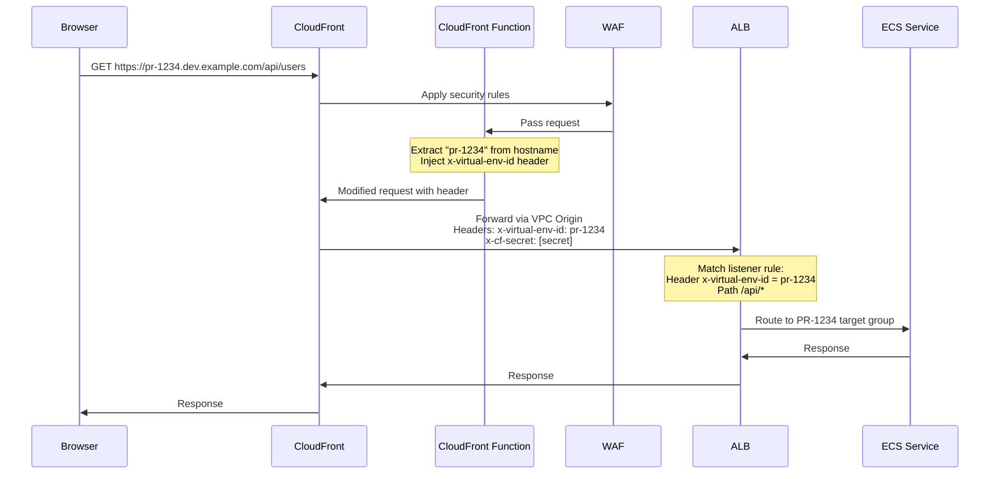
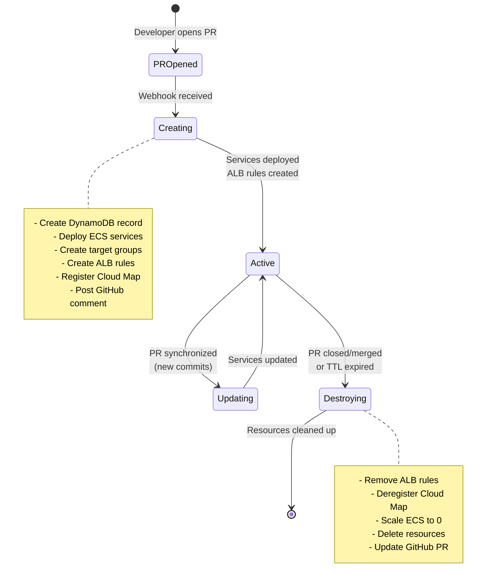
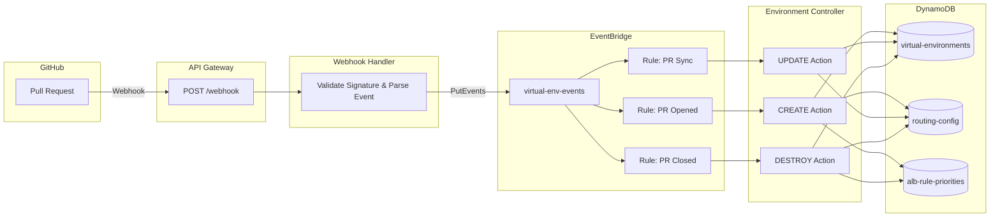
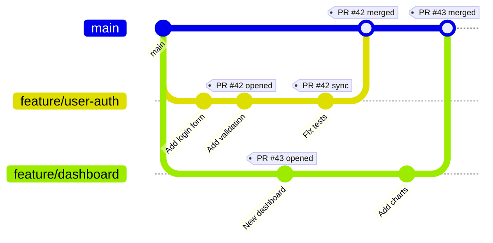
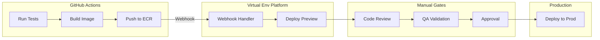
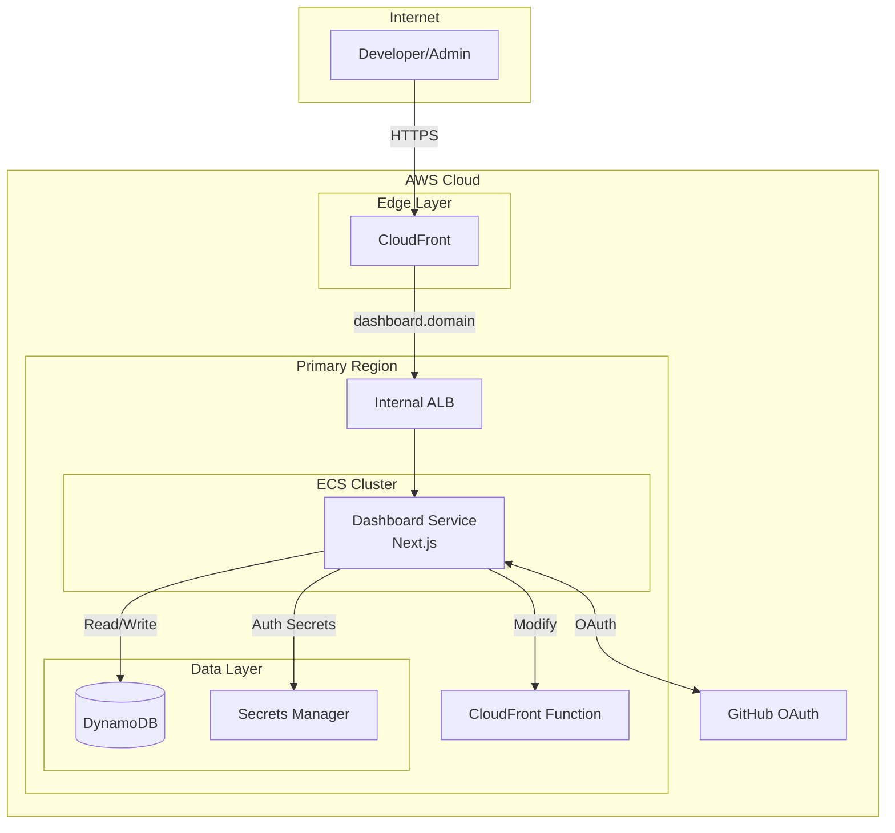

# Virtual Environment Platform

[](https://github.com/YOUR_ORG/dynamic-branch-env/actions/workflows/ci.yml)

> **Note:** Replace `YOUR_ORG` in the badge URL with your GitHub organization/username.

A serverless AWS CDK infrastructure for PR-scoped ephemeral preview environments. This platform enables true continuous delivery by automatically provisioning isolated environments for each pull request, allowing developers and stakeholders to preview changes before merging to trunk.

## Table of Contents

- [Overview](#overview)
  - [Design Decisions](#design-decisions)
- [Architecture](#architecture)
- [How It Works](#how-it-works)
- [Development Workflow](#development-workflow)
- [Management Dashboard](#management-dashboard)
- [Infrastructure Components](#infrastructure-components)
- [Deployment](#deployment)
- [Configuration](#configuration)
- [Security](#security)
- [Operational Considerations](#operational-considerations)

---

## Overview

The Virtual Environment Platform solves the challenge of previewing feature branches in isolation without disrupting shared development environments. Each pull request gets its own dedicated preview URL (`pr-1234.dev.example.com`) that routes to isolated service instances running the feature branch code.

### Key Features

- **Automatic Provisioning**: Environments spin up automatically when PRs are opened
- **Deterministic Routing**: Header-based routing ensures requests reach the correct feature services
- **Zero Infrastructure Overhead**: Serverless control plane with pay-per-use pricing
- **Automatic Cleanup**: TTL-based expiration ensures resources don't accumulate
- **Security-First Design**: Internal ALB with VPC Origins, WAF protection, and secret-based trust

### Design Decisions

#### DEV Environment Only (Not UAT)

This platform is intentionally scoped to **DEV environments only**. While we initially explored extending this capability to UAT, the **data management challenges** proved too complex for the current implementation:

- **Test Data Isolation**: UAT environments require realistic, consistent test data. Managing isolated datasets per PR would require sophisticated data seeding, masking, and teardown procedures.
- **Database State**: Preview environments share the underlying DEV database. UAT would require either:
  - Per-environment database instances (costly, slow to provision)
  - Schema-level isolation (complex migration management)
  - Synthetic data generation (significant development effort)
- **Data Dependencies**: Many services have complex data relationships that are difficult to replicate in ephemeral environments.
- **Compliance Concerns**: UAT often uses production-like data with PII, requiring additional security controls.

**Recommendation**: Use this platform for functional testing and code review in DEV. Continue using dedicated, long-lived UAT environments for integration testing with realistic data scenarios.

#### Third-Party API Integration

If your services integrate with third-party APIs, you can configure a **common DNS entry** to route all preview environments through a shared endpoint:

```
# Instead of each PR calling the third-party directly:
pr-123.dev.example.com → third-party-api.com ❌

# Route through a common internal endpoint:
pr-123.dev.example.com → api-proxy.internal.example.com → third-party-api.com ✓
```

**Benefits of this approach**:
- **Single IP Allowlist**: Third-party vendors only need to allowlist one endpoint
- **Rate Limit Management**: Centralised control over API quotas across all preview environments
- **Credential Management**: API keys stored once, not duplicated per environment
- **Mock/Stub Support**: Easily swap the proxy target for testing scenarios

**Implementation**: Configure your services to use environment variables for external API endpoints:

```typescript
// In your application code
const apiEndpoint = process.env.THIRD_PARTY_API_URL || 'https://api-proxy.internal.example.com';
```

Then set `THIRD_PARTY_API_URL` in your ECS task definition to point to your internal proxy service.

---

## Architecture

### High-Level Architecture



### Request Flow



### Environment Lifecycle



### Control Plane Event Flow



---

## How It Works

### 1. Header-Based Routing

The platform uses a header-based routing strategy to direct traffic to the appropriate service instances:

1. **CloudFront Function** extracts the virtual environment ID from the subdomain
   - `pr-1234.dev.example.com` → `x-virtual-env-id: pr-1234`

2. **ALB Listener Rules** match requests based on the header value
   - Rule: `x-virtual-env-id == pr-1234 AND path == /api/*` → PR-1234 API target group

3. **Fallback to Steady-State**: Requests without a matching header route to trunk services

### 2. VPC Origin Security

CloudFront connects to the internal ALB using **VPC Origins**, which:
- Creates ENIs in your VPC's private subnets
- Routes traffic over AWS's private backbone
- Eliminates the need for a public-facing ALB
- Provides an additional layer of network isolation

### 3. Trust Verification

Requests are verified using a secret header (`x-cf-secret`):
- CloudFront injects the secret on every request
- ALB/services validate the secret before processing
- Prevents direct access attempts bypassing CloudFront

---

## Development Workflow

### Continuous Delivery with Preview Environments



### Developer Experience

#### 1. Open a Pull Request

```bash
git checkout -b feature/amazing-feature
# Make changes...
git push origin feature/amazing-feature
# Open PR on GitHub
```

Within minutes, a comment appears on the PR:

> **Preview Environment Ready**
>
> Your changes are available at: `https://pr-42.dev.example.com`
>
> | Service | Status | URL |
> |---------|--------|-----|
> | api-gateway | Running | [/api](https://pr-42.dev.example.com/api) |
> | web-app | Running | [/](https://pr-42.dev.example.com/) |
>
> This environment will expire in 24 hours or when the PR is closed.

#### 2. Iterate on Changes

Push new commits to your branch:

```bash
git add .
git commit -m "Address review feedback"
git push
```

The environment automatically updates with your latest changes.

#### 3. Review and Collaborate

- **Developers**: Test your changes in isolation
- **Reviewers**: Verify functionality before approving
- **QA**: Run manual tests against the preview URL
- **Stakeholders**: Preview features before they reach production

#### 4. Merge and Cleanup

When the PR is merged or closed:
- Environment is automatically destroyed
- ALB rules are removed
- ECS services are scaled down and deleted
- Resources are cleaned up within minutes

### Integration with CI/CD



### Best Practices for Continuous Delivery

1. **Trunk-Based Development**: Keep feature branches short-lived (< 1-2 days)
2. **Feature Flags**: Use flags for long-running features that span multiple PRs
3. **Automated Testing**: Run tests before preview deployment
4. **Preview for All**: Enable non-technical stakeholders to preview changes
5. **Fast Feedback**: Configure alerts for preview environment failures

---

## Management Dashboard

The platform includes a web-based management dashboard for monitoring and managing preview environments. The dashboard is built with Next.js 15 and deployed to ECS Fargate alongside the preview services.

### Dashboard Features

| Feature | Description |
|---------|-------------|
| **Environment List** | View all active preview environments with status, repository, branch, and TTL |
| **Environment Details** | Detailed view with services, health status, and routing configuration |
| **TTL Management** | Extend environment TTL with one click |
| **Quick Destroy** | Manually destroy environments that are no longer needed |
| **Routing Editor** | Edit ALB path patterns for each service |
| **CloudFront Function Editor** | View and modify the header injection function code |
| **Capacity Dashboard** | Monitor ALB rule usage with warning thresholds |

### Dashboard Architecture



### Dashboard Pages

#### Environments (`/environments`)

View and manage all preview environments:
- Filter by status (ACTIVE, CREATING, FAILED, etc.)
- Quick actions: Preview URL, Destroy
- TTL countdown with warning for expiring environments

#### Environment Detail (`/environments/[envId]`)

Detailed view of a specific environment:
- Status and metadata (repository, branch, PR number)
- TTL with extend functionality
- Services list with health status
- Routing configuration

#### Routing (`/routing`)

Manage ALB routing rules:
- View all active routing configurations
- Edit path patterns per service
- Link to CloudFront function editor

#### CloudFront Function Editor (`/routing/cloudfront`)

Edit the header injection function:
- Syntax-highlighted code editor
- Deploy changes directly to LIVE stage
- View last modified timestamp

#### Capacity (`/capacity`)

Monitor platform capacity:
- ALB rule usage gauge (warning at 70%, critical at 90%)
- Environment count by status
- Priority allocation tracking

### Dashboard Setup

#### Prerequisites

1. GitHub OAuth App credentials
2. Dashboard Docker image built and pushed to ECR
3. CDK Dashboard stack deployed

#### Step 1: Create GitHub OAuth App

1. Go to **GitHub** → **Settings** → **Developer settings** → **OAuth Apps**
2. Click **New OAuth App**
3. Fill in the details:
   - **Application name**: `Virtual Env Dashboard`
   - **Homepage URL**: `https://dashboard.dev.example.com`
   - **Authorization callback URL**: `https://dashboard.dev.example.com/api/auth/callback/github`
4. Click **Register application**
5. Note the **Client ID**
6. Generate a new **Client Secret** and save it securely

#### Step 2: Configure Secrets

Update the dashboard secrets in AWS Secrets Manager:

```bash
# Get the secret ARN from CDK output
SECRET_ARN=$(aws cloudformation describe-stacks \
  --stack-name VirtualEnv-Dashboard \
  --query 'Stacks[0].Outputs[?OutputKey==`SecretArn`].OutputValue' \
  --output text)

# Update the secret with real values
aws secretsmanager put-secret-value \
  --secret-id "$SECRET_ARN" \
  --secret-string '{
    "GITHUB_CLIENT_ID": "your_client_id_here",
    "GITHUB_CLIENT_SECRET": "your_client_secret_here",
    "NEXTAUTH_SECRET": "generate_a_32_char_random_string"
  }'
```

Generate a secure NEXTAUTH_SECRET:

```bash
openssl rand -base64 32
```

#### Step 3: Build and Push Docker Image

```bash
# Navigate to dashboard directory
cd dashboard

# Install dependencies
npm install

# Build the application
npm run build

# Get ECR repository URI from CDK output
REPO_URI=$(aws cloudformation describe-stacks \
  --stack-name VirtualEnv-Dashboard \
  --query 'Stacks[0].Outputs[?OutputKey==`RepositoryUri`].OutputValue' \
  --output text)

# Authenticate with ECR
aws ecr get-login-password --region eu-west-1 | \
  docker login --username AWS --password-stdin "$REPO_URI"

# Build Docker image
docker build -t virtual-env-dashboard .

# Tag and push
docker tag virtual-env-dashboard:latest "$REPO_URI:latest"
docker push "$REPO_URI:latest"
```

#### Step 4: Deploy the Dashboard Stack

```bash
# Deploy with GitHub OAuth context variables
npx cdk deploy VirtualEnv-Dashboard \
  --context githubOAuthClientId=your_client_id \
  --context githubOrgName=your_org_name
```

#### Step 5: Force ECS Deployment

After pushing a new image, force a new deployment:

```bash
aws ecs update-service \
  --cluster virtual-env-cluster \
  --service virtual-env-dashboard \
  --force-new-deployment
```

### Restricting Access

The dashboard uses GitHub OAuth with optional organization membership restriction:

1. **Set `GITHUB_ORG_NAME`**: Only members of this organization can access
2. **OAuth Scopes**: `read:org` and `read:user` are requested
3. **Membership Check**: Validates active membership during sign-in

To restrict to a specific org, set the context variable during deployment:

```bash
npx cdk deploy VirtualEnv-Dashboard \
  --context githubOrgName=my-company
```

### Local Development

Run the dashboard locally for development:

```bash
cd dashboard

# Create .env.local from example
cp .env.example .env.local

# Edit .env.local with your values
# - GITHUB_CLIENT_ID
# - GITHUB_CLIENT_SECRET
# - NEXTAUTH_SECRET
# - AWS credentials

# Install dependencies
npm install

# Run development server
npm run dev
```

Access at `http://localhost:3000`

---

## Infrastructure Components

### Stacks Overview

| Stack | Region | Purpose |
|-------|--------|---------|
| `VirtualEnv-Network` | Primary | VPC, subnets, security groups |
| `VirtualEnv-DnsCert` | us-east-1 | Route53 hosted zone, ACM certificates |
| `VirtualEnv-Routing` | Primary | Internal ALB, Cloud Map namespace |
| `VirtualEnv-EcsCluster` | Primary | Shared ECS Fargate cluster |
| `VirtualEnv-Edge` | us-east-1 | CloudFront, WAF, CloudFront Function |
| `VirtualEnv-ControlPlane` | Primary | Lambda functions, DynamoDB, EventBridge |
| `VirtualEnv-Dashboard` | Primary | Management dashboard (Next.js on ECS) |
| `VirtualEnv-Observability` | Primary | CloudWatch dashboards, alarms |

### DynamoDB Tables

#### virtual-environments
Tracks the state of each preview environment.

| Attribute | Type | Description |
|-----------|------|-------------|
| `virtualEnvId` (PK) | String | e.g., "pr-1234" |
| `status` | String | CREATING, ACTIVE, DESTROYING |
| `repository` | String | "org/repo" |
| `branch` | String | Feature branch name |
| `services` | Map | Service states and metadata |
| `expiresAt` | Number | TTL timestamp |

#### routing-config
Fast lookup for routing decisions.

| Attribute | Type | Description |
|-----------|------|-------------|
| `serviceId` (PK) | String | e.g., "api-gateway" |
| `virtualEnvId` (SK) | String | e.g., "pr-1234" |
| `targetGroupArn` | String | ALB target group ARN |
| `albRuleArn` | String | Listener rule ARN |
| `priority` | Number | Rule priority (1-100) |

#### alb-rule-priorities
Tracks ALB rule priority allocation.

| Attribute | Type | Description |
|-----------|------|-------------|
| `priority` (PK) | Number | Priority number |
| `virtualEnvId` | String | Assigned environment |
| `serviceId` | String | Assigned service |

---

## Deployment

### Prerequisites

- AWS CLI configured with appropriate credentials
- Node.js 18+ and npm
- AWS CDK CLI (`npm install -g aws-cdk`)
- A registered domain in Route53 (or delegate a subdomain)

### Configuration

Set your domain in `cdk.json` or via context:

```json
{
  "context": {
    "domainName": "dev.yourcompany.com",
    "primaryRegion": "eu-west-1",
    "edgeRegion": "us-east-1"
  }
}
```

### Deploy

```bash
# Install dependencies
npm install

# Build the project
npm run build

# Bootstrap CDK (if not already done)
npx cdk bootstrap aws://ACCOUNT_ID/us-east-1
npx cdk bootstrap aws://ACCOUNT_ID/eu-west-1

# Deploy all stacks
npx cdk deploy --all

# Or deploy individually in order
npx cdk deploy VirtualEnv-Network
npx cdk deploy VirtualEnv-DnsCert
npx cdk deploy VirtualEnv-Routing
npx cdk deploy VirtualEnv-EcsCluster
npx cdk deploy VirtualEnv-Edge
npx cdk deploy VirtualEnv-ControlPlane
npx cdk deploy VirtualEnv-Dashboard  # Optional - see Dashboard Setup section
npx cdk deploy VirtualEnv-Observability
```

> **Note**: The Dashboard stack requires additional setup (GitHub OAuth, Docker image). See the [Management Dashboard](#management-dashboard) section for complete setup instructions.

### GitHub App Setup

1. Create a GitHub App in your organization settings
2. Configure webhook URL: `https://<api-gateway-url>/github/webhook`
3. Set webhook secret (store in Secrets Manager)
4. Enable permissions:
   - Pull requests: Read & Write
   - Repository contents: Read
5. Subscribe to events:
   - Pull request (opened, synchronize, closed)

---

## Configuration

### Environment Variables

Configure in `lib/config/environment.ts`:

```typescript
export const DEFAULT_CONFIG = {
  domainName: 'dev.example.com',      // Your preview domain
  ttlHours: 24,                        // Environment TTL
  primaryRegion: 'eu-west-1',          // Main infrastructure region
  edgeRegion: 'us-east-1',             // CloudFront/WAF region (must be us-east-1)
};
```

### Service Configuration

Define previewable services in `lib/config/services.ts`:

```typescript
export const PREVIEWABLE_SERVICES: PreviewableService[] = [
  {
    serviceId: 'api-gateway',
    ecrRepository: 'mycompany/api-gateway',
    containerPort: 3000,
    pathPattern: '/api/*',
    healthCheckPath: '/api/health',
    cpu: 256,
    memoryMiB: 512,
  },
  {
    serviceId: 'web-app',
    ecrRepository: 'mycompany/web-app',
    containerPort: 3000,
    pathPattern: '/*',
    healthCheckPath: '/health',
    cpu: 256,
    memoryMiB: 512,
  },
];
```

---

## Security

### Network Security

- **VPC Isolation**: All compute runs in private subnets
- **VPC Origins**: CloudFront connects via AWS backbone, not public internet
- **Security Groups**: Strict ingress rules (ALB ← VPC CIDR, ECS ← ALB only)
- **No Public IPs**: ECS tasks and ALB have no public exposure

### Edge Security

- **WAF Protection**: Rate limiting and AWS managed rule sets
- **TLS 1.2+**: Minimum protocol version enforced
- **HTTPS Only**: HTTP automatically redirects to HTTPS

### Trust Chain

```
Browser → CloudFront → WAF → CloudFront Function → VPC Origin → ALB → ECS
              ↓                      ↓                    ↓
         Rate limit          Inject headers         Verify x-cf-secret
         Block attacks       x-virtual-env-id       Route by header
```

### Webhook Security

- GitHub webhook signatures validated using HMAC-SHA256
- Webhook secret stored in AWS Secrets Manager
- API Gateway throttling prevents abuse

---

## Operational Considerations

### ALB Rule Limits

AWS ALB has a limit of 100 listener rules. Budget carefully:

| Range | Purpose | Count |
|-------|---------|-------|
| 1-100 | Preview environments | ~80 |
| 101-900 | Steady-state services | 15 |
| 901-1000 | Platform rules | 5 |

**Monitoring**: CloudWatch alarm triggers at 70% capacity.

### Scaling Considerations

- **Max Concurrent PRs**: ~8 with 10 services each
- **Horizontal Scaling**: Consider multiple ALBs for higher limits
- **Cost Optimization**: Use Fargate Spot for preview workloads

### Cleanup Strategy

1. **TTL Enforcement**: Environments expire after configured hours
2. **PR Close**: Immediate cleanup triggered by webhook
3. **Scheduled Scan**: Lambda runs every 15 minutes to catch stragglers
4. **Graceful Drain**: Tasks given 5 minutes to complete requests

### Troubleshooting

| Issue | Check |
|-------|-------|
| Preview URL not working | CloudWatch logs for environment-controller |
| 502 errors | Target group health checks, ECS task status |
| Slow provisioning | EventBridge delivery, Lambda concurrency |
| Cleanup not happening | DynamoDB TTL configuration, cleanup-handler logs |
| Dashboard login fails | GitHub OAuth credentials in Secrets Manager, callback URL |
| Dashboard shows "Access Denied" | User org membership, GITHUB_ORG_NAME configuration |
| Dashboard can't read data | ECS task role IAM permissions, DynamoDB table names |

---

## CDK Commands

| Command | Description |
|---------|-------------|
| `npm run build` | Compile TypeScript |
| `npm run watch` | Watch mode compilation |
| `npm run test` | Run unit tests |
| `npx cdk list` | List all stacks |
| `npx cdk synth` | Synthesize CloudFormation |
| `npx cdk diff` | Compare with deployed |
| `npx cdk deploy --all` | Deploy all stacks |
| `npx cdk destroy --all` | Tear down all stacks |

---

## Contributing

1. Fork the repository
2. Create a feature branch
3. Make your changes
4. Run tests: `npm test`
5. Submit a pull request

---

## License

MIT License - see LICENSE file for details.
