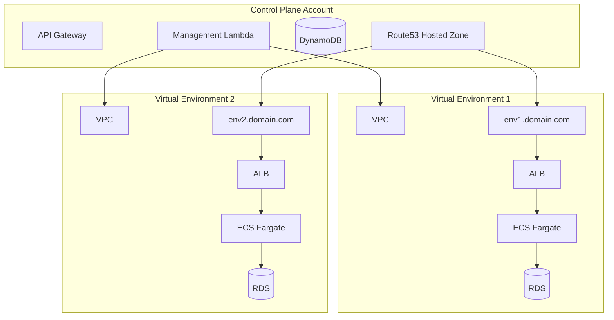

# AWS Deployment Architecture

AWS deployment architecture showing control plane and multiple isolated virtual environments

```mermaid
graph TB
    subgraph "Control Plane Account"
        API[API Gateway]
        Lambda[Management Lambda]
        DDB[(DynamoDB)]
        R53[Route53 Hosted Zone]
    end
    
    subgraph "Virtual Environment 1"
        VPC1[VPC]
        ALB1[ALB]
        ECS1[ECS Fargate]
        RDS1[(RDS)]
        DNS1[env1.domain.com]
    end
    
    subgraph "Virtual Environment 2"
        VPC2[VPC]
        ALB2[ALB]
        ECS2[ECS Fargate]
        RDS2[(RDS)]
        DNS2[env2.domain.com]
    end
    
    Lambda --> VPC1
    Lambda --> VPC2
    R53 --> DNS1
    R53 --> DNS2
    DNS1 --> ALB1
    DNS2 --> ALB2
    ALB1 --> ECS1
    ALB2 --> ECS2
    ECS1 --> RDS1
    ECS2 --> RDS2
```

---
*Generated by Technical Architect Agent*
