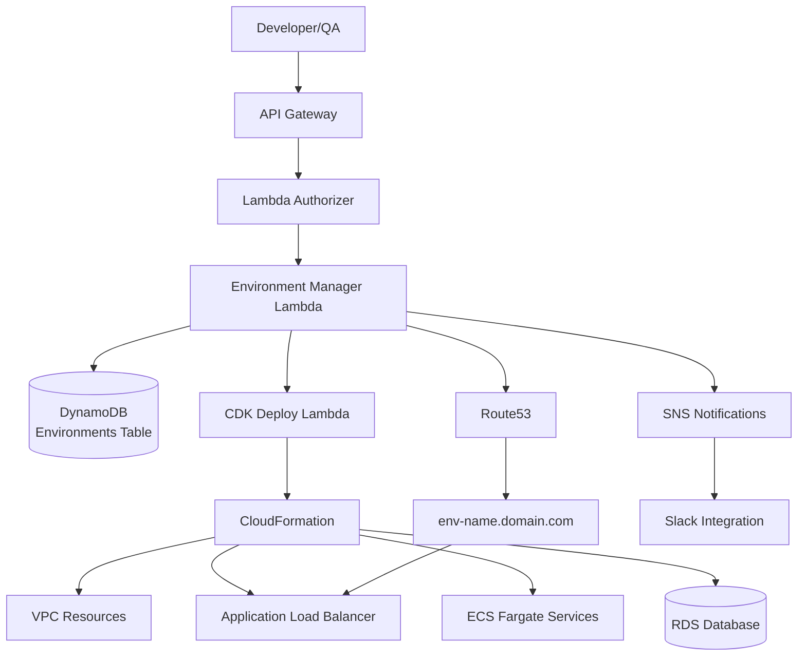

# Virtual Environments Platform - System Architecture

High-level system architecture showing API Gateway, Lambda functions, DynamoDB, and AWS infrastructure provisioning flow

---
*Generated by Technical Architect Agent*
